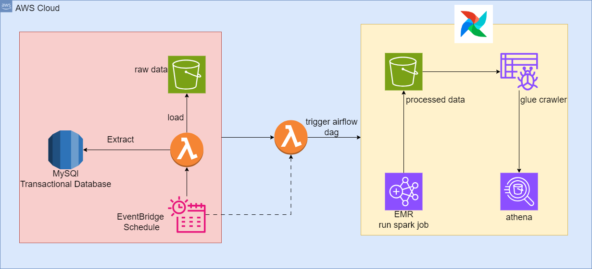
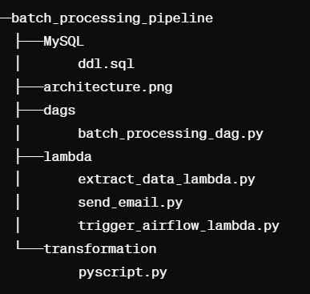

# Batch Processing Pipeline

## Overview
This repository contains the source code and documentation for building a batch processing pipeline for processing data from an internal transaction database and performs data transformation and aggregation on sales and inventory data. Summarizing metrics such as total sales, average price, and stock levels by week, store, and product. Additionally, it partitions and writes the processed data to Parquet files for efficient storage and querying. The pipeline includes the use of AWS Lambda, Amazon EMR (Elastic MapReduce), Apache Airflow, Apache Spark (PySpark), AWS Glue, and Amazon Athena for data extraction, transformation, loading, and querying.

## Architecture Diagram


## Project Workflow
### Step 1: MySQL Database Setup
- Create MySQL database on RDS using the DDL script `/MySQL/ddl.sql`.
- Load the data into the MySQL database.

### Step 2: Lambda Data Extraction
- Implement a Lambda function `/lambda/extract_data_lambda.py` to extract data from the MySQL database.
- Schedule the Lambda function to run daily at midnight (2 am) using Amazon EventBridge.

### Step 3: Triggering Airflow DAG
- Schedule another EventBridge rule to trigger a Lambda function `/lambda/trigger_airflow_lambda.py` at 3 am.
- The Lambda function checks for required files and triggers an Airflow DAG if the files are available. If not, it sends an email notification using Amazon SES (`send_email.py`).

### Step 4: EMR Processing
- Airflow triggers an EMR cluster to process the data from the S3 bucket where raw data is dumped.
- PySpark running on EMR performs the following tasks:
  - Read data from S3.
  - Perform data transformation to generate a dataframe meeting the specified business requirements.
  - Calculate various metrics grouped by week, store, and product.
  - Save the final dataframe as a Parquet file to a new S3 output folder.
  - Copy the files of store, product, and calendar to the output folder for later analysis with Athena.

### Step 5: Athena and Glue Integration
- Connect Athena and Glue with the S3 bucket storing the final fact and dimension tables.
- Query the processed data using Athena for analysis.


## Folder Structure


## Getting Started
### Prerequisites
- MySQL
- AWS Account
- Amazon S3
- Amazon EMR
- Apache Airflow
- AWS Lambda
- Amazon EventBridge
- Amazon SES

### Installation and Setup
1. Clone the repository:
```bash
git clone https://github.com/aravindhKumaran/batch-processing-pipeline.git
```

2. Create Lambda functions:
- Navigate to the `lambda` directory.
- Create Lambda functions for `trigger_airflow_lambda.py` and `extract_data_lambda.py`

3. Create schedulers for 2pm and 3pm:
- Set up EventBridge rules to trigger Lambda functions at 2 pm and 3 pm.
- Configure these rules to schedule the data extraction and Airflow DAG triggering.

4. Set up S3 buckets:
- Create two S3 buckets: one for storing raw data (`raw`) and another for storing processed data (`processed`).
- Partition the `processed` bucket appropriately for efficient querying.

5. Set up folders to save artifacts:
- Create a folder in the S3 bucket to save PySpark and DAG scripts (`artifacts`).


## Notes
- Regularly monitor and maintain the pipeline for optimal performance.
- Ensure proper IAM roles and policies are configured for AWS services.
- Update dependencies and configurations as needed.
